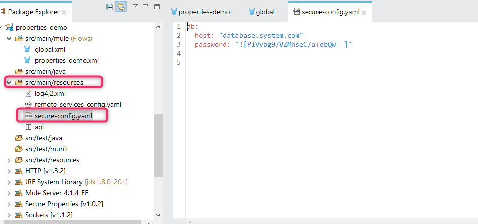
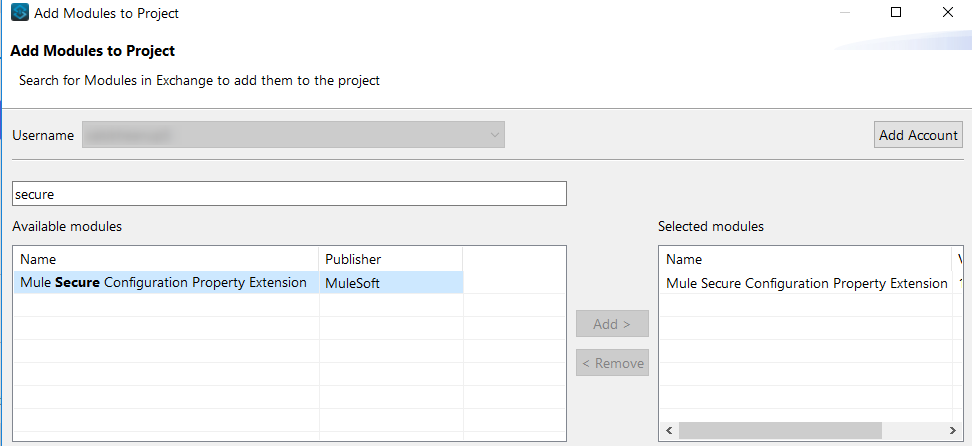
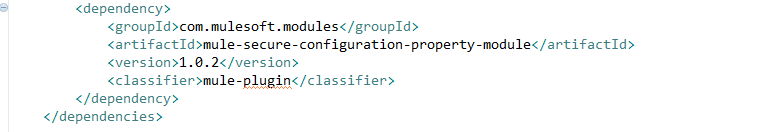
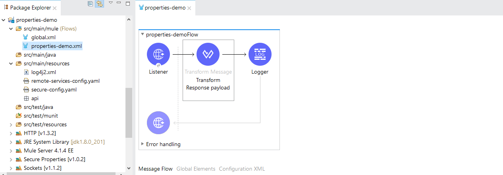
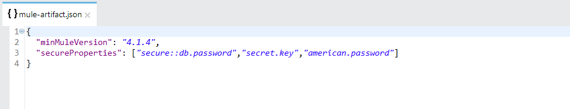
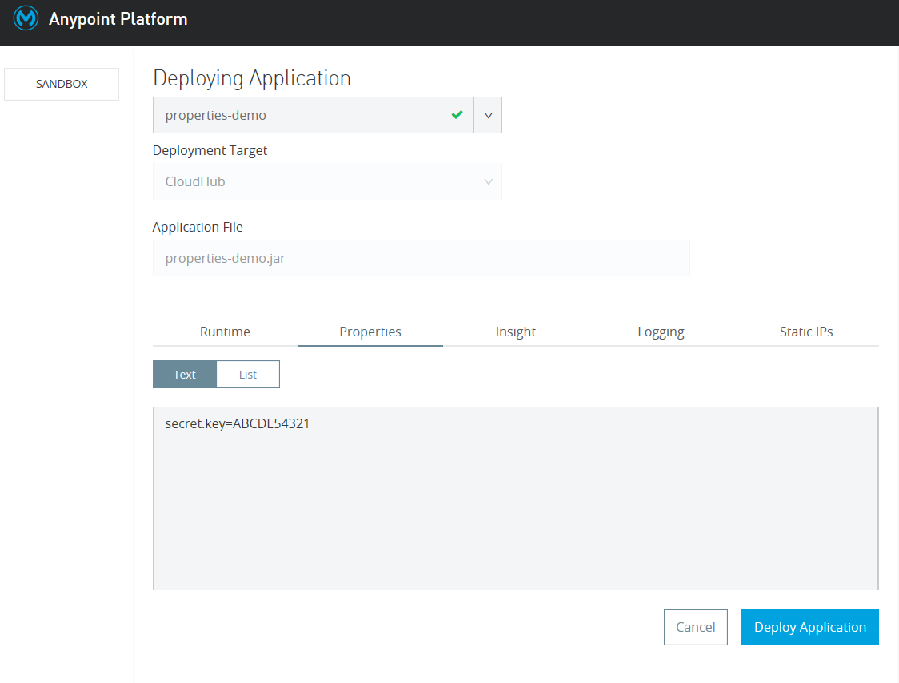
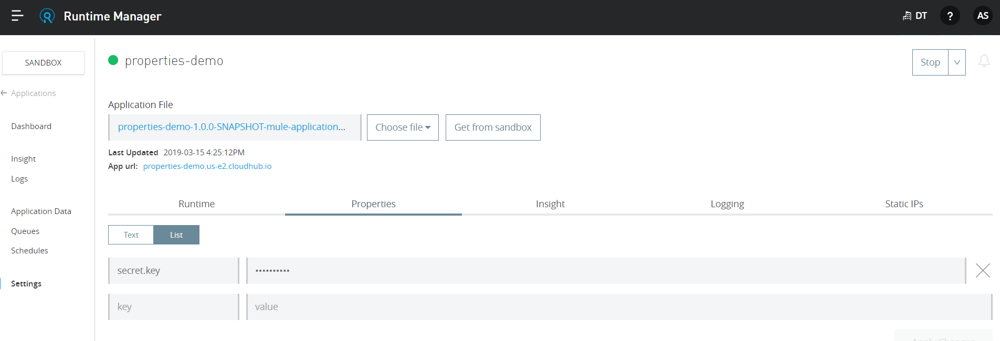
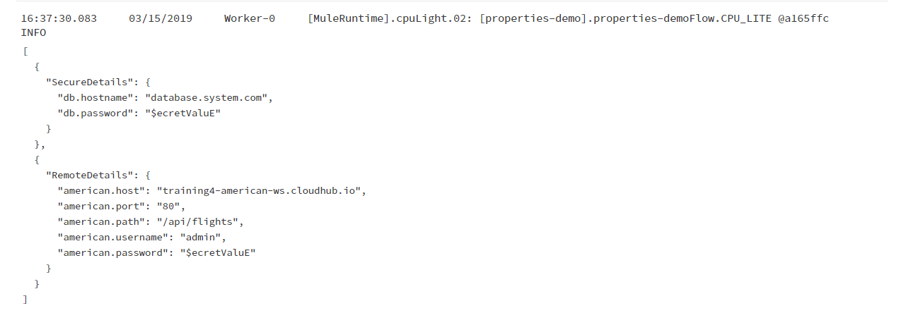
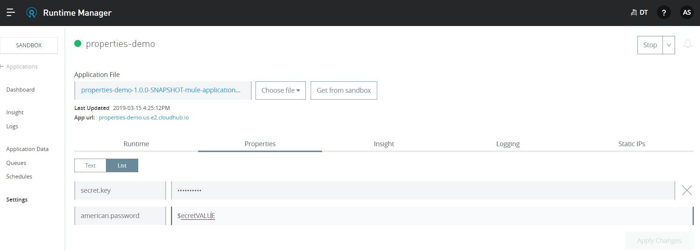

# Securing property values in mule 4
Secure Configuration Properties is an important standard used for keeping the sensitive data password. keys and tokens etc. secure and away from unauthorized users. The Secure Configuration Properties module supports both YAML configuration files and Spring-formatted properties files. The recommended approach is to use a YAML configuration file because it allows the addition of type validations and autocompletion. 

Mule 4 can encrypt the data/values in these files using various algorithms and modes. 

# 1. Tool to Encrypt the values. 
Download the encryption tool @
https://docs.mulesoft.com/mule4-user-guide/v/4.1/_attachments/secure-properties-tool.jar  

**secret key** used for this demo is ABCDE54321 
**Alogorithm** = Blowfish
**Mode** = ECB

# 2. Adding Maven dependencies to your project
Add a module from the exchange or you can directly edit and add the below dependency in the pom.xml

  
  **OR**

  

# 3 Configure the flow 
It is the basic flow with will print and form a basic payload from the values present in the properties files ( From Both Secure Properties and Remote Properties)

# 4 Hiding Application Properties
Mule4 has introduced a new provision of hiding the value for property file from Runtime manager. CloudHub supports safely hiding application properties, where the name of a property is visible in the console, but the value is not displayed or retrievable by any user.

During the development, the Developer uses the secret. the key variable to encrypt the value and the same value can be passed using the System property variable, but as the same secret key can be viewed by anyone who has view access to cloudhub it needs to be protected. Thus, in order to do that we need to protect the visibility of such variables. This can be done in mule 4 using the secure properties property in the mule-artifact.json file. 

# 5 Deploy your application to Cloudhub
Right click on the project select "Anypoint Platform">>"Deploy to Cloudhub" and the below screen will appear. In the properties section Ops person can provide the secret.key value which will be only visible once during deployment.

Secret.key value is not visible anyone and is non-retrievable

# 6 Test your Application
Invoke the deployment application using the below URL 
http://<cloudhud-provisioned-Addresss>/prop-demo
The logger will print the values from secure and remote property files 

# 7 Update the secure Properties file 
If the value of any of the properties changes, we can update the new values directly under the properties section on cloud hub. 
Note: The properties which are mentioned in the mule-artifact.json file will be protected and values won't be visible once the changes are applied. 

